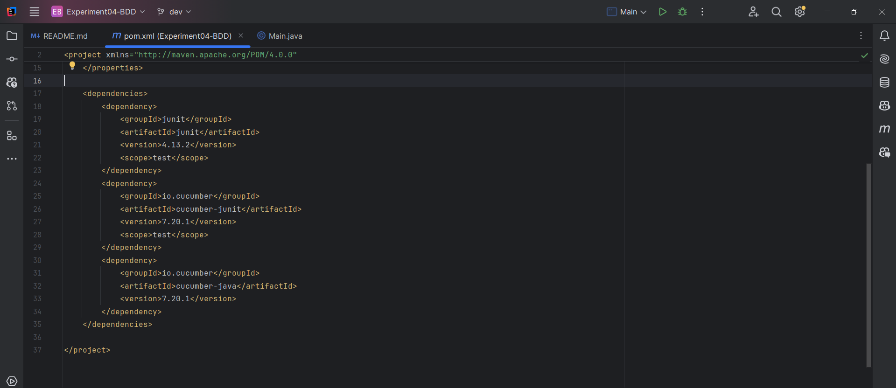
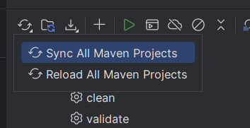
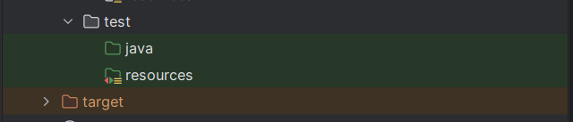
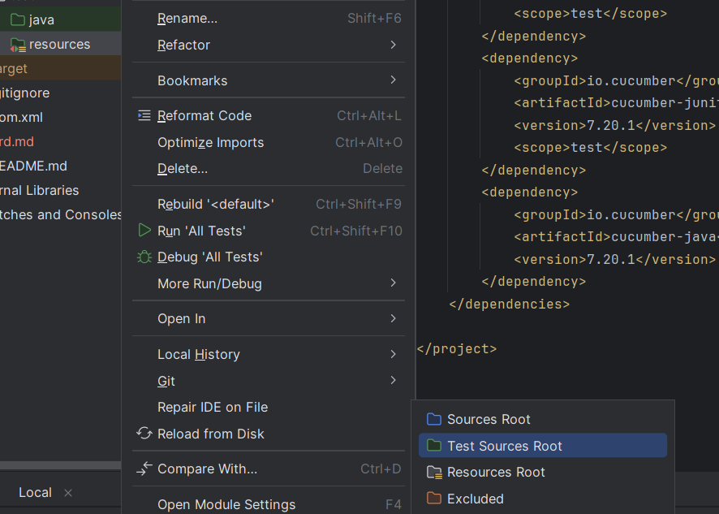
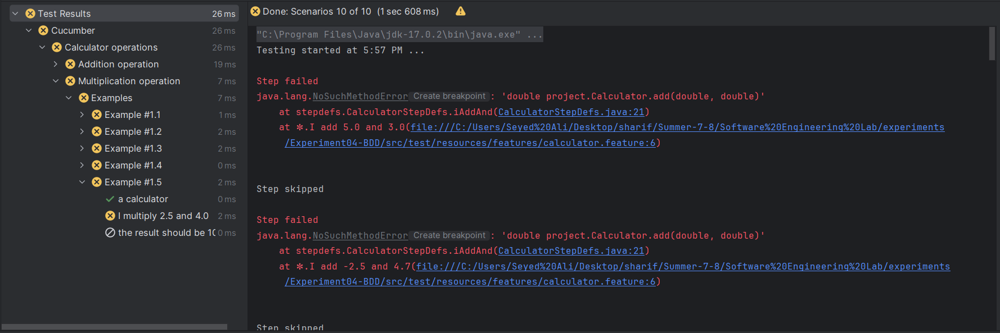
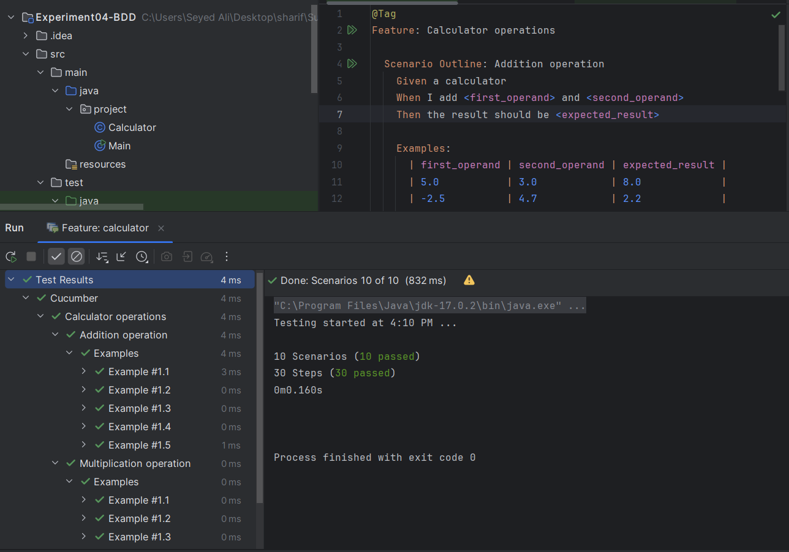
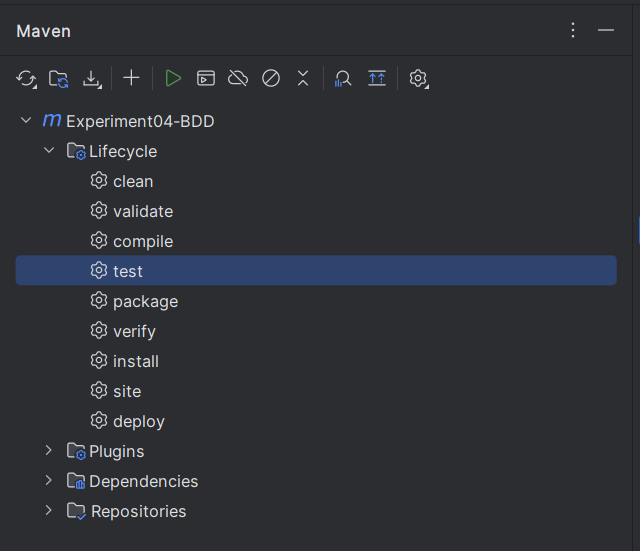
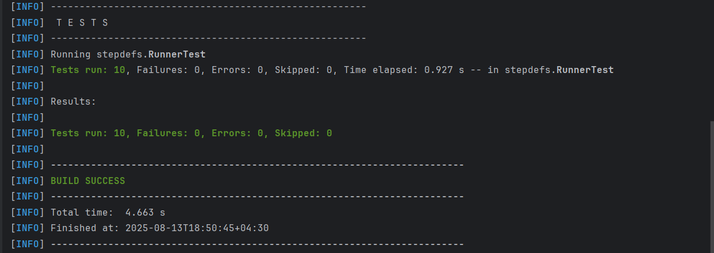

# Experiment04-BDD

## تنظیمات اولیه پروژه

در ابتدا وابستگی‌های لازم پروژه را در فایل **pom.xml** وارد می‌کنیم:



سپس فرایند سینک پروژه را انجام می‌دهیم تا وابستگی‌های لازم را دانلود کند:



در ادامه می‌توان مشاهده کرد که وابستگی‌ها به درستی دانلود شده‌اند:


در ادامه فولدر **resources** را در ساختار پروژه ایجاد می‌کنیم:



سپس روی آن کیک راست کرده و به قسمت Mark Directory as بروید و گزینه Test Sources Root را انتخاب کنید.
علت این کار این است که می‌خواهیم به IDE بگوییم که این پوشه شامل منابع تست است و باید به‌طور خاص با آن رفتار کند.



## پیاده سازی تست‌ها به وسیله Gherkin و Cucumber

### پیاده سازی عملیات‌های جمع و ضرب

در ابتدا سناریوهای مربوط به عملیات‌های جمع و ضرب را در فایل‌های Gherkin تعریف می‌کنیم. برای این کار، یک فایل جدید با نام **calculator.feature** در پوشه **resources/features** ایجاد می‌کنیم و سناریوهای زیر را در آن قرار می‌دهیم:

```gherkin
@Tag
Feature: Calculator operations

  Scenario Outline: Addition operation
    Given a calculator
    When I add <first_operand> and <second_operand>
    Then the result should be <expected_result>

    Examples:
      | first_operand | second_operand | expected_result |
      | 5.0           | 3.0            | 8.0             |
      | -2.5          | 4.7            | 2.2             |
      | 0.0           | 0.0            | 0.0             |
      | -10.0         | -5.0           | -15.0           |
      | 100.5         | 200.3          | 300.8           |

  Scenario Outline: Multiplication operation
    Given a calculator
    When I multiply <first_operand> and <second_operand>
    Then the result should be <expected_result>

    Examples:
      | first_operand | second_operand | expected_result |
      | 5.0           | 3.0            | 15.0            |
      | -2.0          | 4.0            | -8.0            |
      | 0.0           | 100.0          | 0.0             |
      | -3.0          | -7.0           | 21.0            |
      | 2.5           | 4.0            | 10.0            |

```

در اینجا از **Scenario Outline** استفاده می‌کنیم. علت آن این است که می‌خواهیم چندین مثال مختلف را با استفاده از یک سناریو تست کنیم. به جای نوشتن سناریوهای جداگانه برای هر مثال، می‌توانیم از **Examples** استفاده کنیم تا ورودی‌ها و خروجی‌های مختلف را به سادگی تعریف کنیم.

در ادامه قسمت **Step Definitions** را پیاده‌سازی می‌کنیم تا این سناریوها را اجرا کنیم.

```java
import io.cucumber.java.en.Given;
import io.cucumber.java.en.When;
import io.cucumber.java.en.Then;
import project.Calculator;
import static org.junit.Assert.assertEquals;

public class CalculatorStepDefs {

    private Calculator calculator;
    private double result;

    @Given("a calculator")
    public void aCalculator() {
        calculator = new Calculator();
    }

    @When("I add {double} and {double}")
    public void iAddAnd(double firstOperand, double secondOperand) {
        result = calculator.add(firstOperand, secondOperand);
    }

    @When("I multiply {double} and {double}")
    public void iMultiplyAnd(double firstOperand, double secondOperand) {
        result = calculator.multiply(firstOperand, secondOperand);
    }

    @Then("the result should be {double}")
    public void theResultShouldBe(double expectedResult) {
        assertEquals(expectedResult, result, 0.01);
    }
}
```

توضیح ساختار کلی **Step Definitions**:

معادل عباراتی که در فایل **calculator.feature** تعریف شده‌اند، در اینجا به صورت متدهای جاوا پیاده‌سازی شده‌اند. این متدها با استفاده از انوتیشن‌های Cucumber مشخص شده‌اند و به ترتیب مراحل مختلف سناریوها را اجرا می‌کنند.

در این قسمت کلاس **Calculator** را به صورت خالی پیاده‌سازی می‌کنیم.

در ادامه در راستای رعایت اصول TDD و BDD از قسمت **feature**ها تست‌ها را اجرا می‌کنیم.



مشاهده می‌کنیم که تست‌ها با خطا مواجه شده‌اند. در اینجا نیاز است منطق عملیات‌های جمع و ضرب را پیاده‌سازی کنیم.

```java
public class Calculator {

    public double add(double firstOperand, double secondOperand) {
        return firstOperand + secondOperand;
    }

    public double multiply(double firstOperand, double secondOperand) {
        return firstOperand * secondOperand;
    }
}
```

مجددا دوباره تست‌ها را اجرا می‌کنیم و مشاهده می‌کنیم که این بار با موفقیت اجرا شده‌اند.



در ادامه می‌خواهیم با استفاده از **maven test** کلاس های تست را کامپایل و اجرا می‌کنیم.



مشاهده می‌کنیم که تست‌های مرتبط با سناریوهای تعریف شده در فایل **calculator.feature** توسط این دستور اجرا نمی‌شوند.

برای حل این مشکل کلاس **RunnerTest** را ایجاد می‌کنیم.

```java
import io.cucumber.junit.Cucumber;
import io.cucumber.junit.CucumberOptions;
import org.junit.runner.RunWith;

@CucumberOptions(
        features = "src/test/resources/features",
        glue = "stepdefs"
)

@RunWith(Cucumber.class)
public class RunnerTest {
}
```

توضیحات کلاس **RunnerTest**:

کلاس **RunnerTest** به عنوان نقطه ورود برای اجرای تست‌های Cucumber عمل می‌کند. با استفاده از انوتیشن‌های **@RunWith** و **@CucumberOptions**، این کلاس مشخص می‌کند که کدام ویژگی‌ها و مراحل تست باید اجرا شوند. در اینجا، ویژگی‌ها از مسیر **src/test/resources/features** بارگذاری می‌شوند و مراحل تست از بسته **stepdefs** گرفته می‌شوند. با اجرای این کلاس، Cucumber به طور خودکار سناریوهای تعریف شده در فایل‌های ویژگی را شناسایی و اجرا می‌کند.

حال بار دیگر از دستور **maven test** برای اجرای تست‌ها استفاده می‌کنیم.



مشاهده می‌شود تمام تست‌ها با موفقیت اجرا شده‌اند.
